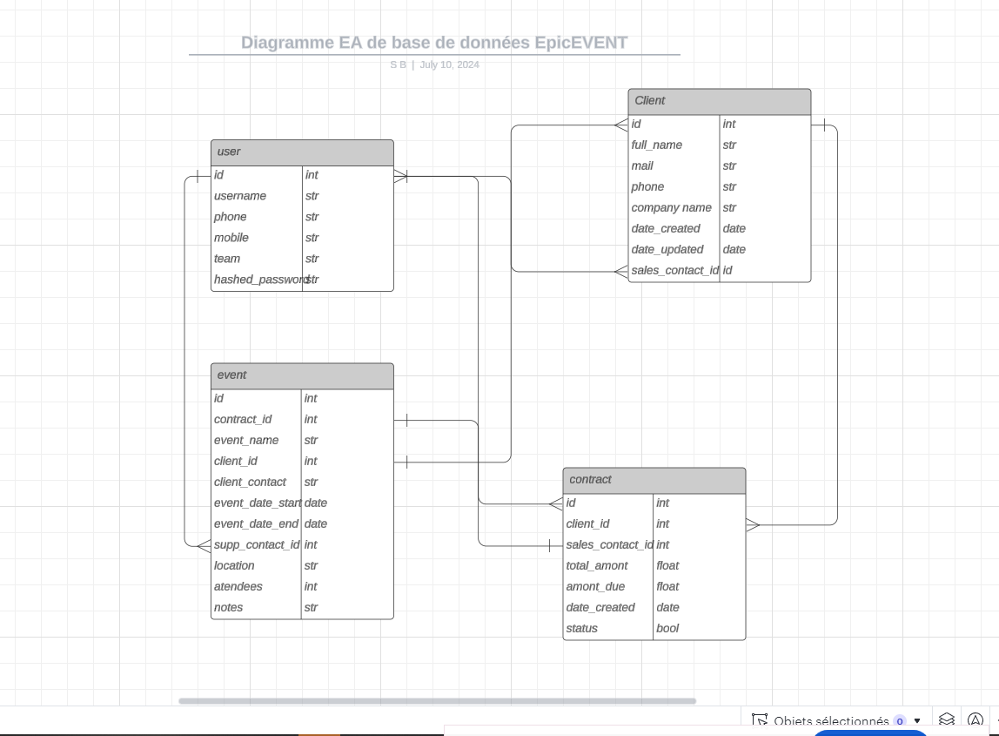

# Epic Events CRM CLI P12 OpenClassRooms

Epic Events CRM CLI est une application en ligne de commande (CLI) développée en Python pour gérer les clients, les contrats et les événements d'une entreprise organisatrice d'événements.

## Fonctionnalités

- **Gestion des utilisateurs :**
  - Créer, afficher, mettre à jour et supprimer des utilisateurs
- **Gestion des clients :**
  - Créer, afficher, mettre à jour et supprimer des clients
- **Gestion des contrats :**
  - Créer, afficher, mettre à jour et supprimer des contrats
- **Gestion des événements :**
  - Créer, afficher, mettre à jour et supprimer des événements
- Affichage des événements non attribués et des événements par contact support
- Affichage des contrats par statut signé/non signé

## Exigences

- Python 3.9 ou une version plus récente
- Bibliothèques Python : `sentry-sdk`, `sqlalchemy`, `passlib`, `datetime`
- Configuration de la base de données SQLAlchemy
- Utilisation de [Sentry](https://sentry.io) pour la journalisation des exceptions et des erreurs

## Installation

1. Clonez le dépôt :
   ```sh
   git clone https://github.com/shmuel-bitan/P12.git
   cd epic-events-crm-cli
   ```

2. Créez un environnement virtuel et activez-le :
   ```sh
   python -m venv venv
   source venv/bin/activate  # Sur Windows, utilisez `venv\Scripts\activate`
   ```

3. Installez les dépendances :
   ```sh
   pip install -r requirements.txt
   ```

4. Configurez votre base de données dans le fichier `db_config.py`.

5. Initialisez Sentry avec votre DSN dans `main.py` :
   ```python
   sentry_sdk.init(
       dsn="votre_dsn_sentry",
       traces_sample_rate=1.0,
       profiles_sample_rate=1.0,
   )
   ```

## Utilisation

Lancez l'application avec la commande suivante :
```sh
python main.py
```
Suivez les instructions à l'écran pour naviguer dans le menu principal et utiliser les différentes fonctionnalités.

## Structure du Projet

- `main.py` : Point d'entrée principal de l'application.
- `controllers.py` : Contient les fonctions de contrôle pour gérer les utilisateurs, clients, contrats et événements.
- `models.py` : Définit les modèles SQLAlchemy pour les utilisateurs, clients, contrats et événements.
- `queries.py` : Contient les fonctions de requêtes à la base de données.
- `views.py` : Contient les fonctions d'affichage et de saisie de l'utilisateur.
- `permissions.py` : Gère les permissions des utilisateurs en fonction de leur rôle.
- `serializers.py` : Définit les serializers pour valider et nettoyer les données d'entrée.

## Permissions des Utilisateurs

- **Équipe de gestion :**
  - Créer, mettre à jour et supprimer des utilisateurs
  - Créer et modifier tous les contrats
  - Filtrer l'affichage des événements
  - Modifier des événements

- **Équipe commerciale :**
  - Créer des clients
  - Mettre à jour les clients dont ils sont responsables
  - Modifier les contrats des clients dont ils sont responsables
  - Filtrer l'affichage des contrats
  - Créer des événements pour leurs clients

- **Équipe support :**
  - Filtrer l'affichage des événements
  - Mettre à jour les événements dont ils sont responsables

## Sécurité

- Validation et nettoyage des entrées utilisateur avec des serializers
- Prévention des injections SQL en utilisant des ORM et des requêtes paramétrées
- Principe du moindre privilège appliqué aux permissions d'accès aux données

## Initialisation de la Base de Données

Pour initialiser la base de données PostgreSQL à partir du fichier `EpicEvent.txt`, suivez ces étapes :

1. Assurez-vous que PostgreSQL est installé et en cours d'exécution sur votre machine.

2. Créez une nouvelle base de données PostgreSQL :
   ```sh
   createdb epic_events_db
   ```

3. Connectez-vous à la base de données :
   ```sh
   psql epic_events_db
   ```

4. Dans le prompt `psql`, exécutez le contenu du fichier `EpicEvent.txt` :
   ```sh
   \i path/to/EpicEvent.txt
   ```

5. Fermez la connexion `psql` :
   ```sh
   \q
   ```

Votre base de données PostgreSQL est maintenant initialisée et prête à être utilisée avec l'application Epic Events CRM CLI.

## Journalisation Sentry

Pour consulter les journaux des exceptions et des erreurs, accédez à votre tableau de bord Sentry [ici](https://oc-u0.sentry.io/issues/?project=4507339447795792).

## Schéma de la Base de Données

Voici une image du schéma de la base de données utilisée dans ce projet :



Vous pouvez également consulter le schéma de la base de données via ce [lien](https://lucid.app/lucidchart/01418ec7-9701-47b4-8ca8-161370729c46/edit?invitationId=inv_360c3dc5-3480-489f-a085-72f6af058875).
